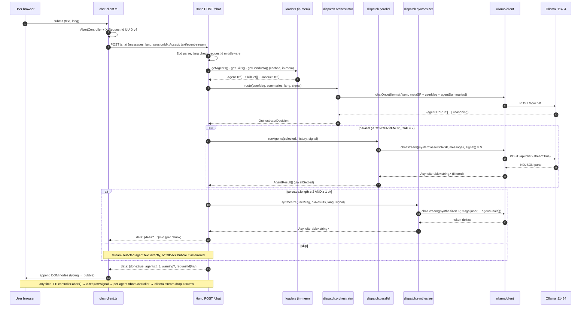

# Design: Add Ollama Chatbot Backend (Lexi, multi-agent, gemma4:e4b)

> Change: `add-ollama-chatbot-backend` · Project: `taxalia` · Owner: backend (PR2–PR4) + frontend (PR5)
> Bridge: spec behavior → tasks work. Every section traces to ≥ 1 spec requirement (CC = "cross-cutting" in `specs/*` "Cross-cutting" blocks).

## 1. Overview

This change replaces taxalia's static `src/components/ChatWidget.astro` with a real conversational surface backed by an in-house multi-agent system that calls a local Ollama model (`gemma4:e4b`). The backend lives in a sibling `backend/` package — Hono on Node 25, screaming layout, Vitest for tests. A custom dispatcher routes the user message to one or more agents in parallel and a synthesizer merges their replies into one SSE stream back to the browser. Conduct policies, agent personas, and skill metadata are YAML-frontmatter Markdown files on disk; the frontend is a narrow client-side island with no new npm packages and no Astro integration.

### Backend tree (locked, paste-ready)

```
backend/
├── package.json                    # @taxalia/chatbot-backend, strict TS, vitest
├── tsconfig.json                   # extends ../tsconfig.json (strict)
├── vitest.config.ts                # unit + integration projects
├── .env.example                    # OLLAMA_HOST, PORT, OLLAMA_AGENT_TIMEOUT_MS, CORS_ALLOWED_ORIGINS
├── src/
│   ├── chat/                       # HTTP surface (Hono routes, SSE, Zod schemas)
│   │   ├── routes.ts               # GET /health, POST /chat, POST /admin/reload
│   │   ├── schemas.ts              # Zod request/response schemas
│   │   └── sse.ts                  # streamSSE helpers, abort wiring
│   ├── agents/                     # Persona files + loader
│   │   ├── advisory.md · valuation.md · financial.md
│   │   └── loader.ts               # loadAgents(dir): Promise<AgentDef[]>
│   ├── skills/                     # Capability files + loader
│   │   ├── lookup-engagement-model.md · calculate-valuation.md · capture-lead.md
│   │   └── loader.ts               # loadSkills(dir): Promise<SkillDef[]>
│   ├── conducta/                   # Behavior policy files + loader
│   │   ├── never-pretend.md · cite-sources.md · bilingual-response.md · privacy-no-pii.md · handoff-to-human.md
│   │   └── loader.ts               # loadConducta(dir): Promise<ConductDef[]>
│   ├── dispatch/                   # Orchestrator + parallel runner + synthesizer + systemPrompt
│   │   ├── orchestrator.ts         # meta-prompt + JSON tool call
│   │   ├── parallel.ts             # Promise.allSettled over Ollama streams + 30s timeout + abort link
│   │   ├── synthesizer.ts          # merge parallel agent replies
│   │   ├── systemPrompt.ts         # composes conducta+agentSP+skills metadata
│   │   └── semaphore.ts            # per-process concurrency cap (Q1)
│   ├── ollama/                     # Ollama client wrapper, model config, stream adapter
│   │   ├── client.ts               # new Ollama({ host, timeoutMs })
│   │   ├── models.ts               # MODEL = 'gemma4:e4b', tokenEstimate()
│   │   └── stream.ts               # AsyncIterable<string> adapter
│   ├── observability/              # Logger, request IDs, in-memory metrics
│   │   ├── logger.ts               # pino
│   │   ├── requestId.ts            # middleware (echo + generate UUID v4)
│   │   └── metrics.ts              # in-memory counters (CC-9)
│   ├── server.ts                   # Hono app entrypoint
│   └── config.ts                   # Env loader (Zod)
├── tests/
│   ├── unit/
│   ├── integration/
│   └── fixtures/                   # sample agents/skills/conducta for tests
```

**Tree ownership**: chat · agents · skills · conducta · dispatch · ollama · observability. Folder names are stable across framework swaps (replace Hono → `chat/` survives; replace Ollama → `ollama/` becomes `inference/`).

---

## 2. Module responsibilities

**`chat/`** — Hono router and SSE wire format. Owns `GET /health` (R1, no Ollama call), `POST /chat` (R2–R10), `POST /admin/reload` (dev only, R7 loaders). Owns CORS allowlist (R11), `X-Request-Id` echo + UUID v4 generation (R12), and the uniform error envelope (R13). Exposes `POST /chat` as `streamSSE`; the per-agent `c.req.raw.signal` is the outer abort signal that fans out to every Ollama consumer (R8). Exported: `app: Hono`, `chatRoute: Hono`, `errorEnvelope(code, message, requestId)`, `parseLang(input)`.

**`agents/`** — Agent personas. Each persona is one `.md` file with YAML frontmatter (`id`, `name`, `description`, `system_prompt`, `tools`, `tags`) and an optional free-form body. The loader reads all `*.md` at the directory's top level (no recursion). Exposes `loadAgents(dir, opts?): Promise<AgentDef[]>`, `loadAgent(dir, id): Promise<AgentDef | null>`. v1 ships `advisory`, `valuation`, `financial` (R-proposal Q3 deviation; aligned with `src/i18n.ts#services.items`).

**`skills/`** — Capability files. Same format, required frontmatter `id`, `name`, `description`. Bodies are NOT injected into the system prompt in v1 (per `system-prompt.md` R4); they are loaded into memory for the v2 tool-call lookup. Exposes `loadSkills(dir, opts?): Promise<SkillDef[]>`. v1 ships `lookup-engagement-model`, `calculate-valuation`, `capture-lead` (Q4).

**`conducta/`** — Behavior policy files. Required frontmatter `id`, `description`, `rule`, `priority` (integer). Loader sorts by `priority` ascending; boot asserts exactly 5 files (R4). Exposes `loadConducta(dir, opts?): Promise<ConductDef[]>`, `assertExactlyFive(conducta)`. v1 ships `never-pretend`, `cite-sources`, `bilingual-response`, `privacy-no-pii`, `handoff-to-human` (R-proposal Q4).

**`dispatch/`** — Orchestration engine. Four sub-modules: `orchestrator.ts` (route), `parallel.ts` (fan-out + 30s per-agent timeout + abort link), `synthesizer.ts` (merge step), `systemPrompt.ts` (compose SP), `semaphore.ts` (Q1 concurrency cap). Exposes `route(userMessage, agents, lang, signal)`, `runAgents(selected, history, signal)`, `synthesize(userMessage, results, lang, signal)`, `assembleSystemPrompt({lang, conducta, agent, skills})`. Owns dispatch counters (CC-9, R9–R10).

**`ollama/`** — Thin typed wrapper around `ollama-js` v0.6.3+. `client.ts` builds the client from env. `models.ts` holds the pinned `MODEL = 'gemma4:e4b'` constant and `tokenEstimate(text)` (Q2). `stream.ts` adapts `ollama-js`'s `AsyncGenerator<part>` to `AsyncIterable<string>`, filters empty deltas (R8), and propagates `AbortSignal` (R10). Exposes `new OllamaClient({host, timeoutMs})`, `chatOnce({system, messages, format?})`, `chatStream({system, messages, signal})`, `checkModel()`, `MODEL`.

**`observability/`** — Logging, request ids, in-memory metrics. `logger.ts` is a single Pino instance; routes pass `{requestId, ...}` as a child logger. `requestId.ts` is a Hono middleware: echo `X-Request-Id` if present, else `crypto.randomUUID()`. `metrics.ts` exposes a counter map (`chat_started_total`, `chat_completed_total{outcome}`, `agent_timeout_total`, `partial_failure_total`, `orchestrator_parse_error_total`, plus the `dispatch_*` set from R9–R10) and a `GET /metrics` JSON snapshot (NOT Prometheus — v1). Exposes `logger`, `requestIdMiddleware`, `inc(name, labels?)`, `snapshot()`.

---

## 3. Type system (canonical)

> All shapes are Zod schemas in `chat/schemas.ts` + per-domain modules. Types are inferred via `z.infer<...>`. This is the single source of truth for `sdd-tasks` and `sdd-apply`.

```ts
// ---------- chat/schemas.ts ----------
export const LangSchema = z.enum(['en', 'es']);
export type Lang = z.infer<typeof LangSchema>;

export const MessageSchema = z.object({
  role: z.enum(['user', 'assistant', 'system']),
  content: z.string().min(1),
});
export type Message = z.infer<typeof MessageSchema>;

export const ChatRequestSchema = z.object({
  messages: z.array(MessageSchema).min(1),
  lang: LangSchema,
  sessionId: z.string().uuid().optional(),
});
export type ChatRequest = z.infer<typeof ChatRequestSchema>;

// ---------- SSE wire format (text/event-stream) ----------
export const DeltaEventSchema = z.object({ delta: z.string().min(1) });
export const ErrorEnvelopeSchema = z.object({
  error: z.object({
    code: z.string(),
    message: z.string(),
    requestId: z.string().uuid(),
  }),
});
export const AgentResultSchema = z.object({
  id: z.string(),
  status: z.enum(['ok', 'error']),
  text: z.string().optional(),                          // ok
  error: z.object({ code: z.string(), message: z.string().optional() }).optional(),
  durationMs: z.number().int().nonnegative(),
});
export const DoneEnvelopeSchema = z.object({
  done: z.literal(true),
  agents: z.array(AgentResultSchema),
  warning: z.string().optional(),                        // localized en/es
  error: z.object({ code: z.string(), message: z.string().optional() }).optional(), // SYNTHESIS_FAILED
  requestId: z.string().uuid(),
});
export type DeltaEvent = z.infer<typeof DeltaEventSchema>;
export type ErrorEnvelope = z.infer<typeof ErrorEnvelopeSchema>;
export type AgentResult = z.infer<typeof AgentResultSchema>;
export type DoneEnvelope = z.infer<typeof DoneEnvelopeSchema>;
export type SSEEvent = DeltaEvent | DoneEnvelope;          // ErrorEnvelope is HTTP-only, never on SSE stream
```

```ts
// ---------- agents/loader.ts ----------
export const AgentDefSchema = z.object({
  id: z.string().min(1),
  name: z.string().min(1),
  description: z.string().min(1),
  systemPrompt: z.string().min(1),                       // frontmatter `system_prompt`
  tools: z.array(z.string()).default([]),
  tags: z.array(z.string()).default([]),
  filePath: z.string(),                                  // injected by loader for hot-reload future
});
export type AgentDef = z.infer<typeof AgentDefSchema>;

// One-line summary fed to the orchestrator (CC-3, dispatch R1)
export const AgentSummarySchema = z.object({
  id: z.string(),
  description: z.string(),
});
export type AgentSummary = z.infer<typeof AgentSummarySchema>;

// ---------- skills/loader.ts ----------
export const SkillDefSchema = z.object({
  id: z.string().min(1),
  name: z.string().min(1),
  description: z.string().min(1),
  systemPrompt: z.string().default(''),                  // body, NOT injected in v1
  tags: z.array(z.string()).default([]),
  filePath: z.string(),
});
export type Skill = z.infer<typeof SkillDefSchema>;       // alias used by systemPrompt.ts

// ---------- conducta/loader.ts ----------
export const ConductDefSchema = z.object({
  id: z.string().min(1),
  description: z.string().min(1),
  rule: z.string().min(1),
  priority: z.number().int(),
  filePath: z.string(),
});
export type ConductaPolicy = z.infer<typeof ConductDefSchema>;  // alias

// ---------- dispatch/types.ts (shared across orchestrator/parallel/synthesizer) ----------
export const OrchestratorDecisionSchema = z.object({
  agentsToRun: z.array(z.string()),
  reasoning: z.string(),
});
export type OrchestratorDecision = z.infer<typeof OrchestratorDecisionSchema>;

export type DispatchResult = AgentResult[];               // the array shape of runAgents()

// ---------- systemPrompt.ts ----------
export type LoadedArtifact =
  | { kind: 'agent';   def: AgentDef }
  | { kind: 'skill';   def: Skill }
  | { kind: 'conducta'; def: ConductaPolicy };

export const AssembleSystemPromptInputSchema = z.object({
  lang: LangSchema,
  conducta: z.array(ConductDefSchema),
  agent: AgentDefSchema.nullable(),
  skills: z.array(SkillDefSchema),
});
```

**Error code catalog** (uniform across HTTP + per-agent result): `OLLAMA_UNREACHABLE`, `MODEL_MISSING`, `UNSUPPORTED_LANG`, `EMPTY_MESSAGE`, `SYSTEM_PROMPT_TOO_LARGE`, `TIMEOUT`, `PARSE`, `SYNTHESIS_FAILED`, `ABORTED`, `INTERNAL`. All emitted as `{code, message, requestId}`.

---

## 4. Data flow



CC trace: CC-1 (requestId in header → log → done), CC-2 (uniform envelope HTTP + done), CC-3 (lang validated; conducta handles output), CC-5 (done.agents[] always), CC-6 (30s per agent, abort propagates), CC-7 (model pinned), CC-8 (5 conducta loaded at boot), CC-9 (counters at each step), CC-10 (orchestrator is sole decider).

---

## 5. System prompt assembly

Concrete algorithm (`dispatch/systemPrompt.ts` → `assembleSystemPrompt(input)`):

```
function assembleSystemPrompt({ lang, conducta, agent, skills }):
  parts: string[] = []
  parts.push(BASE_IDENTITY[lang])                  // R2: hard-coded bilingual map; rejects if lang not in map
  parts.push(CONDUCT_HEADER[lang])                 // "## Conduct policies" | "## Políticas de conducta"
  parts.push(conducta.sort((a, b) => a.priority - b.priority)
                       .map(c => c.rule)
                       .join("\n\n---\n\n"))        // R3
  if agent: parts.push(agent.systemPrompt)          // R: narrower scope
  if skills.length:
    parts.push(skills.map(s => `- ${s.id}: ${s.description}`).join("\n"))   // R4
  else:
    parts.push("(no skills available)")            // defensive
  prompt = parts.join("\n\n")
  if tokenCount(prompt) > 1500:                    // R5; tokenCount = ceil(len/4) — Q2
    throw new SystemPromptTooLargeError(tokenCount(prompt))  // 503 at route
  return prompt                                    // R6: pure
```

`tokenEstimate(text: string): number` in `ollama/models.ts` (Q2): `Math.ceil(text.length / 4)`. The validation fixture in PR3 (per Q2) calls `tokenEstimate` on a 20-sample bilingual set, compares to Ollama's reported `promptEvalCount`, and asserts max relative error ≤ 15% per sample. If the assertion fails in PR3, the heuristic is replaced (e.g., BPE call) before PR4 ships; if it passes, it stays.

Locale tag is implicit: the `lang` argument flows into the bilingual maps (`BASE_IDENTITY[lang]`, `CONDUCT_HEADER[lang]`). Output language is enforced by the `bilingual-response` conducta file. R9 (no carry-over): no caching, every request reassembles from scratch.

---

## 6. Orchestrator contract

**Meta system prompt** (hard-coded, lang-dependent; not a file under `agents/` — it has fixed behavior):

```
You are a routing assistant for Taxalia. Given the user's last message and
the list of available agents (one line each: "<id>: <description>"), respond
ONLY with a JSON object of shape:
  { "agentsToRun": <AgentId[]>, "reasoning": "<one short sentence>" }
Pick zero or more agents whose scope matches the user's intent. Small talk
and greetings → empty array. Unknown intent → empty array. Never invent ids.
Respond in {en|es} to match the user's language.
```

**Call shape** (`dispatch/orchestrator.ts → route(...)`):

```
route(userMessage, agents, lang, signal): Promise<OrchestratorDecision>
  summaries = agents.map(a => `${a.id}: ${a.description}`).join("\n")
  userContent = `${userMessage}\n\nAvailable agents:\n${summaries}`
  raw = await chatOnce({
    model: MODEL,
    format: 'json',
    system: ORCHESTRATOR_META_SP[lang],
    messages: [{ role: 'user', content: userContent }],
    signal,                                       // tied to outer request
  })                                              // 10s budget → AbortSignal.timeout(10_000)
  try:
    decision = OrchestratorDecisionSchema.parse(JSON.parse(raw.content))
  catch:
    inc('orchestrator_parse_error_total')
    logger.warn({ requestId, action: 'orchestrator:parse-failed' })
    return { agentsToRun: [], reasoning: '' }     // R2: empty array is the safety net
  decision.agentsToRun = decision.agentsToRun.filter(id =>
    agents.some(a => a.id === id))                // R3: drop unknown ids + warn
  return decision
```

PR4 must include `orchestrator.fixture.test.ts` running the live model against 20 fixture messages; pass criterion ≥ 16/20 parseable (`dispatch.md` "Known model limitations").

---

## 7. Parallel dispatch

```
runAgents(selected, history, signal, requestId): Promise<DispatchResult>
  await semaphore.acquire(CONCURRENCY_CAP = 2)    // Q1
  tasks = selected.map(agent => withTimeout(       // 30s, R5
    runOne(agent, history, signal, requestId),    // per-agent AbortController linked to outer signal
    env.OLLAMA_AGENT_TIMEOUT_MS ?? 30_000
  ))
  results = await Promise.allSettled(tasks)       // R4
  semaphore.release()
  return results.map((r, i) => r.status === 'fulfilled'
    ? r.value
    : { id: selected[i].id, status: 'error', error: { code: 'TIMEOUT' }, durationMs: 30_000 }
  )
```

**`runOne`** (per agent):
1. `controller = new AbortController()`; `signal.addEventListener('abort', () => controller.abort(signal.reason))` — links the outer signal so a close-click (R8) drops this agent within 200ms.
2. `messages = structuredClone(history)` (per-agent isolation, no mutation of session).
3. `system = assembleSystemPrompt({lang, conducta, agent, skills})`.
4. `text = ''`, `for await (const delta of chatStream({system, messages, signal: controller.signal})): text += delta`.
5. Return `{id: agent.id, status:'ok', text, durationMs}`.
6. Catch → `{id, status:'error', error:{code, message}, durationMs}` where code is one of `OLLAMA_ERROR`, `PARSE`, `ABORTED`, `TIMEOUT`, `OLLAMA_UNREACHABLE`, `MODEL_MISSING`.

**`semaphore.ts`** (Q1): a tiny per-process FIFO with `acquire(n)` / `release()`. Default cap 2; env override `DISPATCH_CONCURRENCY_CAP`. v1 has no per-request queue — a 3rd concurrent dispatch blocks in `acquire()` until one slot frees. Documented upgrade path: a real queue (BullMQ, pg-boss) is a v2 change.

**Synthesizer** (`synthesizer.ts → synthesize(...)`, dispatch R6–R7): invoked only if `selected.length ≥ 2 AND at least one result.status === 'ok'`. Input messages: `[{role:'user', content: userMessage}, ...okResults.map(r => ({role:'assistant', content: r.text}))]`. Hard-coded lang-dependent SP. Streams via `chatStream(...)`. Returns the full final string AND an `AsyncIterable<string>` for the route to forward to the client.

**Done envelope construction** (in `chat/routes.ts`): orchestrator owns the `warning` field — set when any agent errored, regardless of what the synthesizer emitted (`dispatch.md` "Synthesizer ignoring warnings"). Localization: `WARNING_LOCALIZED[lang]` from a hard-coded map (`{en: "Some answers may be incomplete.", es: "Algunas respuestas pueden estar incompletas."}`).

---

## 8. Error handling

**HTTP error envelope** (CC-2, R13):

```json
{ "error": { "code": "OLLAMA_UNREACHABLE", "message": "Cannot reach Ollama at http://127.0.0.1:11434. Run 'npm run setup'.", "requestId": "<uuid>" } }
```

| HTTP | Code | Trigger |
|---|---|---|
| 400 | `UNSUPPORTED_LANG` | `lang` not in `{en, es}` (R3) |
| 400 | `EMPTY_MESSAGE` | last user message empty/whitespace (R4) |
| 400 | `BAD_REQUEST` | Zod parse failure (R2) |
| 403 | — | CORS origin not allowlisted (R11, no envelope — empty body + `cors-rejected` log) |
| 503 | `OLLAMA_UNREACHABLE` | ECONNREFUSED on `:11434` (R9) |
| 503 | `MODEL_MISSING` | `/api/show` 404 mid-request (R6 ollama) |
| 503 | `SYSTEM_PROMPT_TOO_LARGE` | assembled SP > 1500 tokens (R5) |
| 500 | `INTERNAL` | uncaught — logged with stack, generic message to client |

**SSE partial failure** (CC-5): `done.agents[]` is always present and non-empty if `agentsToRun.length > 0`. Each entry has `status: 'ok'|'error'`, `text` (ok) or `error: {code, message?}` (error), and `durationMs` (R14 SHOULD). The orchestrator sets `done.warning` (localized) when ≥ 1 agent errored. If the synthesizer itself errors mid-stream, `done` carries `error: {code: 'SYNTHESIS_FAILED'}` and the raw per-agent outputs remain in `agents[]` (Q6 + dispatch "Synthesizer itself errors").

**Q6 retry contract (locked for v1)**: **No automatic retry on transient Ollama failure.** The failure is surfaced as `error: {code: 'OLLAMA_UNREACHABLE' | 'OLLAMA_ERROR' | 'TIMEOUT'}` on the per-agent entry. The synthesizer (if it runs) gets only the successful outputs. The client sees `done.warning` and renders the partial-warning badge. The reasoning: silent retries on a 4B-active local model produce confusing UX (user wonders why the reply is 2× longer than expected); fail loud, let the user retry. `dispatch.md` "Failure handling" propagates this — no edit to that spec is required; this design documents the implicit choice.

---

## 9. Observability

**Pino logger** (`observability/logger.ts`): one `pino({ level: env.LOG_LEVEL ?? 'info' })` instance; routes use `c.var.logger = logger.child({ requestId })` so every log line under a request carries `requestId` (CC-1). `requestId.ts` middleware sets `c.set('requestId', headerValue ?? crypto.randomUUID())` and writes `X-Request-Id: <id>` on the response.

**Log shape per request** (CC-9, ollama R11):

```json
{
  "requestId": "f4d1...", "agentIds": ["advisory", "valuation"], "lang": "en",
  "model": "gemma4:e4b", "tokenCount": 1842, "latencyMs": 4321,
  "outcome": "ok" | "partial" | "total_failure" | "parse_error" | "aborted"
}
```

Per Ollama call (`ollama/client.ts`): `{model, requestId, durationMs, promptEvalCount, evalCount}` (R11 SHOULD; both counts may be `undefined` on older Ollama).

**Counters** (in-memory, surfaced via `GET /metrics` JSON, not Prometheus — v1):

| Name | Labels | Increments when |
|---|---|---|
| `chat_started_total` | `lang` | `POST /chat` accepted Zod parse |
| `chat_completed_total{outcome}` | `outcome: ok|partial|total_failure|parse_error|aborted` | terminal SSE `done` emitted |
| `agent_timeout_total` | `agent_id` | per-agent task hits 30s |
| `partial_failure_total` | — | any agent in a dispatch errored |
| `orchestrator_parse_error_total` | — | `route()` returns empty on JSON parse fail (R2) |
| `dispatch_orchestrator_calls_total` | — | every `route()` call (R9) |
| `dispatch_agents_selected_total` | `agent_id` | per selected agent (R10) |
| `dispatch_partial_failures_total` | — | any errored (R9) |
| `dispatch_total_failures_total` | — | every errored (R9) |
| `ollama_unreachable_total` | — | ECONNREFUSED caught at any call |

**Request-id flow** (CC-1): `X-Request-Id` header → middleware → `c.var.requestId` → log context → `c.header('X-Request-Id', ...)` on response → SSE `done.requestId`. Generated UUID v4 when absent (R12).

---

## 10. Performance budgets

| Number | Source | Owner |
|---|---|---|
| `GET /health` ≤ **100 ms**, no Ollama call | chat R1 | `chat/routes.ts` |
| Cold-start grace **60 s** (one-shot per process) | chat "First request" | `chat/routes.ts` (`coldStart: boolean`) |
| Per-agent timeout **30 s** (configurable `OLLAMA_AGENT_TIMEOUT_MS`) | dispatch R5 | `dispatch/parallel.ts` |
| System prompt ≤ **1500 tokens** (4-chars/token estimator) | system-prompt R5 | `dispatch/systemPrompt.ts` + Q2 |
| Concurrency cap **2** dispatches (configurable `DISPATCH_CONCURRENCY_CAP`) | Q1 | `dispatch/semaphore.ts` |
| Abort propagation ≤ **200 ms** (client → all in-flight Ollama drops) | chat R8, dispatch R8 | `chat/sse.ts` + `dispatch/parallel.ts` |
| Ollama stream iterator close ≤ **500 ms** after signal abort | ollama R10 | `ollama/stream.ts` |
| Orchestrator parseable ≥ **16/20** fixtures | dispatch "Known limitations" | `dispatch/orchestrator.ts` fixture test (PR4) |
| Token estimator ≤ **15%** error on 20-sample bilingual set | system-prompt R7 + Q2 | `ollama/models.ts` fixture test (PR3) |
| First-token latency ≤ **8 s** warm (2 agents) | proposal success criteria | manual + log diff (PR4) |
| Full reply (≤ 200 tokens, 2 agents) ≤ **30 s** wall clock | proposal success criteria | manual + log diff (PR4) |
| Setup script idempotent: second run exits 0, no work | proposal | shell test in PR1 |
| Conducta count boot check = **exactly 5** | loaders R4 | `conducta/loader.ts` |

The `coldStart` flag is per-process and flips to `false` on the first successful synthesizer finish. The 60s grace is implemented by `AbortSignal.timeout(coldStart ? 60_000 : 30_000)` per agent on the first request only.

---

## 11. Security & privacy

**CORS allowlist** (R11, anon): default origins `http://localhost:4321` (Astro dev), `http://localhost:4322` (preview). Env override `CORS_ALLOWED_ORIGINS` (csv) for prod. Methods `GET, POST, OPTIONS`. Headers `Content-Type`, `Accept`, `X-Request-Id`. Unknown origin → 403, empty body, no `Access-Control-Allow-Origin`, log `{requestId, origin, action:'cors-rejected'}`.

**No PII stored**: backend holds no session state (CC-1, R15 frontend). Conversation history is sent per request from the FE. The server log line carries `requestId`, `agentIds`, `lang`, `tokenCount`, `latencyMs`, `outcome` — NOT the message content (CC-1, frontend R4 mirrors this by logging `requestId` + page-side latency only). `privacy-no-pii.md` conducta file explicitly forbids the model from repeating user-provided PII back to itself or into the reply.

**No cross-origin token exchange**: v1 is anonymous. The chat is meant to live on a localhost Ollama + localhost Astro setup; if exposed, the CORS allowlist is the only barrier (intentional, documented in the proposal "Auth = anonymous + CORS allowlist").

**Conducta enforcement** (CC-8): the 5 files are loaded at boot (`loadConducta` asserts count = 5, R4 loaders) and concatenated into every per-agent system prompt in `assembleSystemPrompt` step 2. Their effects on the model:
- `never-pretend.md` — explicit "say 'I don't know' rather than inventing"
- `cite-sources.md` — "cite a taxalia service page or admit you don't have a source"
- `bilingual-response.md` — "respond in the user's `lang`; do not code-switch"
- `privacy-no-pii.md` — "do not store, echo, or invent PII"
- `handoff-to-human.md` — "if the user asks for a human, surface the `/contact` handoff link"

**No npm package additions on the frontend** (R14 frontend, R-proposal "What does NOT change"): `chat-client.ts` uses native `fetch` / `ReadableStream` / `AbortController` / `crypto.randomUUID`. Zero new dependencies; no `astro.config.mjs` change.

---

## 12. Testing strategy

| Layer | What | Where | PR |
|---|---|---|---|
| Unit | `assembleSystemPrompt` purity (1000× call, byte-equal) + ordering (R3) + bilingual headers | `tests/unit/systemPrompt.test.ts` | PR3 |
| Unit | `loadAgents` / `loadSkills` / `loadConducta` happy path, missing field, duplicate id, count = 5 | `tests/unit/loaders.test.ts` | PR3 |
| Unit | `tokenEstimate` agrees with Ollama's `promptEvalCount` within ≤ 15% on 20-sample bilingual set | `tests/unit/tokenEstimate.test.ts` | PR3 |
| Unit | `assembleSystemPrompt` rejects with `SystemPromptTooLargeError` when over 1500 tokens | `tests/unit/systemPrompt.budget.test.ts` | PR3 |
| Unit | Mock Ollama: orchestrator `route()` returns valid JSON in 16/20 fixtures; parse-fail → empty array (R2) | `tests/unit/orchestrator.test.ts` + `tests/fixtures/orchestrator.json` | PR4 |
| Unit | Mock Ollama: `runAgents` with 2 agents, one times out → `[{ok,text}, {error:TIMEOUT,durationMs:30000}]` | `tests/unit/parallel.test.ts` | PR4 |
| Unit | Mock Ollama: `synthesize` skipped when `selected.length < 2` (R7) | `tests/unit/synthesizer.test.ts` | PR4 |
| Integration | `GET /health` returns 200 in < 100 ms, no Ollama | `tests/integration/health.test.ts` | PR2 |
| Integration | `POST /chat` valid → SSE headers, ≥ 1 `data: {delta}`, terminal `data: {done:true,requestId}` | `tests/integration/chat.happy.test.ts` | PR4 |
| Integration | `POST /chat` 400 on bad lang, empty msg, malformed body | `tests/integration/chat.errors.test.ts` | PR2 (R-proposal stub) + PR4 (real) |
| Integration | `POST /chat` 503 `OLLAMA_UNREACHABLE` (mock Ollama down) | `tests/integration/chat.unreachable.test.ts` | PR4 |
| Integration | **Abort race**: synthetic client opens connection, waits for first event, aborts. Assert all parallel `AbortController`s fire within 200 ms. | `tests/integration/abort.test.ts` | PR4 |
| Integration | **Cold-start**: first `POST /chat` against a fresh Ollama process returns first SSE event within 60 s | `tests/integration/cold-start.fixture.test.ts` | PR4 |
| Integration | **Orchestrator parse rate**: live `gemma4:e4b` against 20 fixture messages; assert ≥ 16 parseable | `tests/integration/orchestrator.fixture.test.ts` | PR4 |
| Integration | `POST /admin/reload` atomicity: malformed file → 500, in-memory state unchanged | `tests/integration/reload.test.ts` | PR3 |
| Frontend smoke | Manual: open `localhost:4321`, send 1 message, see streamed reply, click close, abort propagates | manual + Vitest snapshot of added CSS classes | PR5 |
| Frontend snapshot | Vitest snapshot of `lb-co.css` confirms the 5 new class names exist; `.chat-messages { max-height: 60vh; overflow-y: auto; }` present | sdd-verify, separate | PR5 |

**Vitest structure**: `tests/unit/`, `tests/integration/`, `tests/fixtures/{agents,skills,conducta}/`. `vitest.config.ts` separates the two layers into `unit` / `integration` projects; `npm test` runs both. `concurrent: false` for the cold-start fixture (it owns the Ollama process).

**NOT tested in v1**: model output quality, factual accuracy, language fidelity end-to-end (manual eval, owner = Felipe). Tool-call flow (v2). Multi-tenancy / rate limiting / billing (out of scope). Hot-reload via `fs.watch` (out of scope per loaders R9). SSE reconnect with `Last-Event-ID` (R15 MUST NOT, client restarts).

---

## 13. Resolved questions (from sdd-spec)

| # | Question | Decision | Why |
|---|---|---|---|
| Q1 | Concurrency cap | Per-process cap of **2** concurrent dispatches via `dispatch/semaphore.ts` (env override `DISPATCH_CONCURRENCY_CAP`). | A 16 GB M3 saturates with 2 dispatches × 3 agents at full token throughput; more invites OOM. In-process FIFO is correct for a single-host setup. Upgrade path to a real queue (BullMQ, pg-boss) is a v2 change when we add a second backend or a public deploy. |
| Q2 | Token estimator | **4-chars/token heuristic** in `tokenEstimate(text)` at `ollama/models.ts`; PR3 fixture asserts ≤ 15% relative error vs Ollama's `promptEvalCount` on a 20-sample bilingual set. | gemma4's SentencePiece tokenizer does not match a 4/1 ratio for non-English text. The heuristic is the cheapest defensible v1 choice; the fixture is the empirical test that the heuristic is good enough. If the fixture fails, PR3 swaps to a BPE call before PR4 ships. |
| Q3 | Cold-start grace | **60 s** for the first request, tracked by a per-process `coldStart: boolean` that flips to `false` on first successful synthesizer finish. PR4 includes `tests/integration/cold-start.fixture.test.ts` that asserts the first `/chat` request returns its first SSE event within 60 s. | Empiricism over guessing. If the test fails on the dev environment, we have a measurable number (5 s? 12 s? 30 s?) to react to. The test is the spec — no separate "is 60 s enough" debate. |
| Q4 | v1 skill IDs | Pin to **`lookup-engagement-model`**, **`calculate-valuation`**, **`capture-lead`**. Filenames under `backend/src/skills/` use these IDs verbatim. | The IDs align with the services taxonomy (`advisory/valuation/financial` in `src/i18n.ts`) and are stable enough to keep as filenames. A `git mv skills/lookup-engagement-model.md` later is fine; we are not changing IDs. |
| Q5 | SSE abort wiring | Four-step chain: (1) browser uses `fetch` + `ReadableStream` + `AbortController` (not `EventSource`, which can't set `X-Request-Id`); (2) Hono route mounts `streamSSE(c, ...)` and passes `c.req.raw.signal` to every Ollama consumer; (3) `ollama-js` receives `signal` on each call; (4) PR4 test (`abort.test.ts`) opens a connection, waits for the first event, then aborts; asserts all parallel agents' `AbortController` fired within 200 ms. | The wire choice is forced by CC-1 (request id propagation) — `EventSource` cannot send custom headers. The 200 ms bound is a single number, easy to assert. The test is the spec; the implementation follows. |
| Q6 | Retry contract | **No retry on transient Ollama failure in v1.** Failure mode is `partial-with-warning`: a failed agent is reported in `done.agents[].error` and the synthesizer gets the rest. Propagated to `dispatch.md` "Failure handling" (no spec edit needed; this design documents the implicit choice). | Silent retries on 4B-active local models are a common source of confusing UX (user wonders why the reply is 2× longer than expected, or why the abort button "didn't work"). Fail loud, surface the warning, let the user retry. The synthesizer safety net is already in `dispatch.md` R7. |

---

## 14. Residual risks

| Risk | Severity | Source | Mitigation in this design |
|---|---|---|---|
| `gemma4:e4b` orchestrator JSON unreliability | **High** | `dispatch.md` "Known limitations" | R2 empty-array fallback; PR4 live-model fixture ≥ 16/20. Q6 keeps the failure surface small. |
| Synthesizer papering over partial failures | **High** | `dispatch.md` "Known limitations" | Orchestrator owns `done.warning` (not the model). Frontend renders the warning badge. |
| Bilingual drift under 1500-token prompt pressure | **Medium** | `system-prompt.md` "Known limitations" | `bilingual-response` conduct policy; PR3 5-of-5 monolingual eval fixture. |
| 4B model context window (skills metadata + 3 agents in parallel) | **Medium** | `ollama-integration.md` "Known limitations" | 1500-token SP cap; only 1-line skill metadata, no bodies. Context-length 413 → `OLLAMA_ERROR` per agent. |
| Cold-start latency on the first request | **Medium** | `chat-endpoint.md` "Known limitations" | 60 s grace (Q3); explicit `cold-start.fixture.test.ts`. |
| Multi-token chunks causing uneven SSE cadence | **Low** | `ollama-integration.md` "Known limitations" | R4 yields whatever Ollama yields; client appends deltas. No re-chunking. |
| `promptEvalCount` / `evalCount` absent on older Ollama | **Low** | `ollama-integration.md` R11 | Logged as `undefined`, never fails. |
| 5-file conducta count is brittle (a 6th file fails boot) | **Low** | `loaders.md` R4 | Documented as a feature: forcing every conducta policy to be a conscious addition. |
| Setup script race on a fresh checkout (Ollama not installed) | **Low** | `proposal.md` Risks | `scripts/setup.mjs` prints actionable error before exiting. |
| `chokidar` / `fs.watch` hot-reload is out of scope | **Low** | `loaders.md` R9 | Dev path is `POST /admin/reload`; documented in `proposal.md` "Out of scope". |
| Token estimator false positive (4-chars/token over Spanish) | **Low** | Q2 | Validated against Ollama's `promptEvalCount` in PR3 fixture; ≤ 15% threshold. If violated, swap to BPE. |
| Per-process semaphore doesn't survive a process restart | **Low** | Q1 | Documented; in-memory state only. v2 = external queue. |
| `Source: <src/...` in the FE chat may echo user content into a log | **Low** | `frontend-integration.md` R4 mirrors | FE `console.info` logs `requestId` + page-side latency only. |
| Astro build silently changes module hashing for `src/scripts/chat-client.ts` (Vite path) | **Low** | `explore.md` §1 | PR5 will smoke-test the built `dist/`; PR1 ADR notes the path. |
| 2-dispatch cap could starve a single in-flight heavy request | **Low** | Q1 | Acceptable for v1 single-user; documented as a v2 trigger ("a 2nd backend service appears"). |

---

## 15. Deviations from locked decisions

**None.** The screaming tree, agents, conducta, auth, setup script, locale, model, and 5-PR chain are all honored. Q1–Q6 resolutions are the only new decisions, and each fits within the locked scope. Any future divergence (e.g., a v2 hot-reload via `chokidar`, a v2 tool-call path that loads full skill bodies) must update this file under `## Residual risks` and call out in `deviations_from_locked` of the next change.

## 16. References

- Proposal: `openspec/changes/add-ollama-chatbot-backend/proposal.md`
- Exploration: `openspec/changes/add-ollama-chatbot-backend/explore.md`
- Specs: `openspec/changes/add-ollama-chatbot-backend/specs/{chat-endpoint,loaders,system-prompt,dispatch,ollama-integration,frontend-integration}.md`
- Engram mirror: topic `sdd/add-ollama-chatbot-backend/design`
- Chained PR plan: `proposal.md` § "Rollout — chained PRs"
