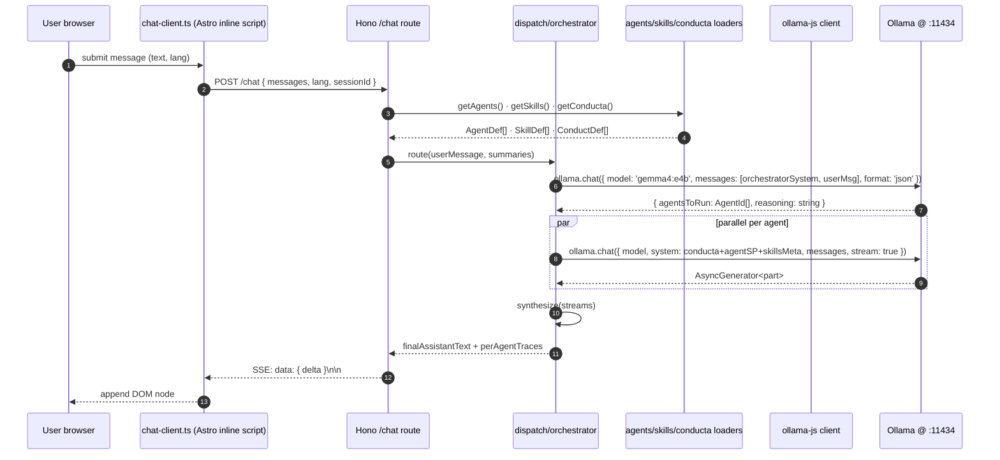
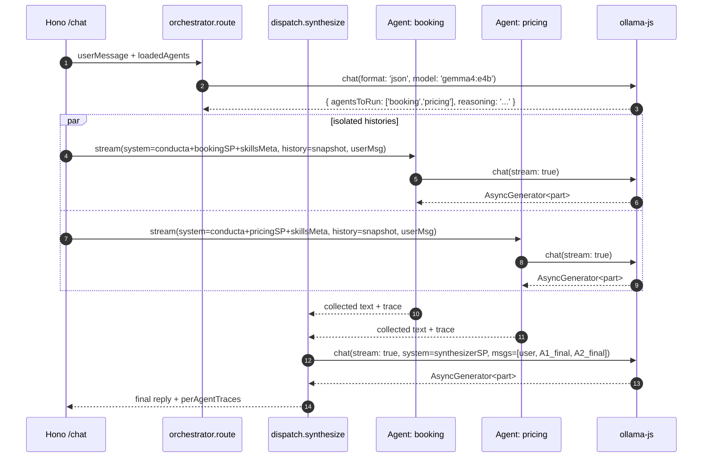

# Exploration: add-ollama-chatbot-backend

> Date: 2026-06-02 · Project: taxalia · Change: `add-ollama-chatbot-backend`
> Artifact store: hybrid (this file + Engram topic_key `sdd/add-ollama-chatbot-backend/explore`)
> Preflight: A2 (automatic) · B3 (hybrid) · C3 (force-chained PRs) · D1 (400 LOC review budget)

---

## 1. Frontend integration surface

### Current state

The taxalia frontend ships a **static** chat widget. It is **not a real chat** — the "Ask a Question" button is an `<a>` tag that navigates to `/contact`. The widget is the user-facing entry point that this change **replaces** (not extends).

**Files in the existing widget:**

| File | Role |
|---|---|
| `src/components/ChatWidget.astro` (41 lines) | Markup: header (avatar + name + status), close button, greeting bubble, "Ask a Question" anchor. Props: `lang?: Lang`. Reads `ui[lang].chat` for all copy. |
| `src/assets/css/lb-co.css` (lines 390–469) | Fixed-position widget, 320px wide, bottom-right (`right: 1.5rem; bottom: 1.5rem;`), z-index 2000, white surface, accent-bordered avatar, soft-bubble greeting. All styles already exist. |
| `src/layouts/Base.astro` (lines 78–83) | Inline `<script>` that wires `#chat-close` to `.remove()` the `#chat-widget` element. One global event handler, no module, no framework. |
| `src/i18n.ts` (lines 172–179 / 328–335) | `ui.en.chat` and `ui.es.chat` blocks with 6 keys each. |
| `public/assets/images/agent-lexi.webp` (65 KB) | Pre-shipped avatar, 80×80 px per `public/assets/images/README.md`. |

**`ui[lang].chat` shape (both `en` and `es`):**
```ts
chat: {
  ariaLabel: string;     // "AI Assistant" / "Asistente de IA"
  imageAlt: string;      // "Lexi, AI Assistant" / "Lexi, asistente de IA"
  status: string;        // "AI Assistant" / "Asistente de IA"
  close: string;         // "Close chat widget" / "Cerrar widget de chat"
  bubble: string;        // "Hi! I'm Lexi, your AI Assistant. How can I help you today?" / ...
  action: string;        // "Ask a Question" / "Hacer una pregunta"
}
```

**Mounting:**
- Mounted in `src/pages/index.astro` (line 29, English home only).
- Mounted in `src/pages/es/index.astro` (line 29, Spanish home only).
- **Not** mounted in `about.astro`, `blog.astro`, `services.astro`, `contact.astro`, nor their `/es/` mirrors.
- No SSR data, no env vars, no client-side fetch — purely server-rendered HTML.

**Current DOM contract the new widget must preserve or break intentionally:**
- `id="chat-widget"` — used by `Base.astro` close script and by CSS.
- `id="chat-close"` — wired to `widget.remove()`.
- `class="chat-widget chat-widget-header chat-agent chat-agent-avatar chat-agent-name chat-agent-status chat-close chat-widget-body chat-bubble"` — all CSS rules in `lb-co.css` depend on these.
- `aria-label` and `aria-hidden` attributes are already used correctly (the close button has `aria-label`).

**Static redirect mechanism (lines 37–39 of `ChatWidget.astro`):**
```astro
<a href={localizePath(lang, '/contact')} class="btn" style="...">
  {copy.action}
</a>
```
This is the part that becomes a real chat surface. The new widget replaces this anchor with a message list + input.

### Affected areas

- `src/components/ChatWidget.astro` — **REPLACE** in-place. Keep filename, keep Props interface, keep `ui[lang].chat` keys (add a few more keys for new copy: input placeholder, send button, typing indicator, error toast). Mark the old `<a>` to `/contact` as deprecated fallback link inside the widget (e.g., a "talk to a human" footer link) for the lead-capture handoff.
- `src/i18n.ts` — add new keys under `ui[lang].chat` for the dynamic UX. Keep existing 6 keys; do not remove `ariaLabel`, `imageAlt`, `status`, `close` (they remain accurate).
- `src/assets/css/lb-co.css` (lines 390–469) — extend, do not rewrite. Add new classes for `.chat-messages`, `.chat-input`, `.chat-msg--user`, `.chat-msg--assistant`, `.chat-typing` underneath the existing widget shell. The persona header + close button styles can be reused unchanged.
- `src/layouts/Base.astro` (lines 78–83) — **replace** the `chatClose?.addEventListener('click', ...)` block with a richer bootstrap: import the chat client module (lazy), wire the input, open an `EventSource` or `fetch` stream. Keep the inline `<script>` model for now (Astro 6 ships no client island system without adding an integration, which `openspec/config.yaml` forbids).
- `astro.config.mjs` — **no change**. The Astro config is intentionally minimal.
- `package.json` — **no new frontend dependencies** in v1. The chat client will use `fetch` + `ReadableStream` (native) to consume the backend's SSE. If we later need AbortController helpers, we can add them; for now, native API only.

### Bridge contract the new chat UX will need

The new chat will need these pieces of cross-component glue (all to be implemented in `Base.astro`'s inline `<script>` or extracted to `src/scripts/chat.ts` and imported with a `type="module"`):

1. **Mount target**: `<div id="chat-widget-mount" />` inside the new ChatWidget.astro. The bootstrap script reads this element and instantiates the chat client there.
2. **Config block**: `<script type="application/json" id="chat-config">{ "apiBase": "http://localhost:8787", "lang": "en" }</script>` to avoid hard-coding the backend URL. Astro can pass `Astro.url.origin` or a `PUBLIC_CHAT_API_BASE` env via Vite.
3. **Streaming transport**: `fetch` to `${apiBase}/chat` with `Accept: text/event-stream` (SSE) — matches the chosen backend's `streamSSE` helper.
4. **Abort on close**: a click on `#chat-close` (still present) calls `controller.abort()` on the active stream and removes the mount node.
5. **Lexi persona**: keep the avatar `` and the "Lexi" name in the header. The new assistant messages should also display that avatar so the persona stays consistent.

### Frontend-integration brief (output)

- **Replace** `src/components/ChatWidget.astro` end-to-end. Filename + Props interface stay.
- **Extend** `src/i18n.ts` `ui[lang].chat` with new keys: `placeholder`, `send`, `typing`, `error`, `personaName` (currently the literal `"Lexi"` is hard-coded in the `.astro`, move it to i18n for future persona swaps), `humanHandoff` (the "Talk to a person" link to `/contact`).
- **Extend** `src/assets/css/lb-co.css` (do not rewrite). Reuse existing `.chat-widget*` classes; add new ones for messages + input.
- **Replace** the close handler in `src/layouts/Base.astro` (lines 78–83) with a bootstrap that imports `src/scripts/chat-client.ts` (new file) and calls `init({ mount: '#chat-widget-mount', config: '#chat-config' })`. The existing close behaviour (remove widget) is preserved as a special case.
- **No `astro.config.mjs` or `package.json` change** on the frontend.
- **Lexi persona** stays the visible identity. The avatar file and CSS class names carry over untouched.

---

## 2. Backend stack decision

### Comparison (TS-first, Node 25.2.0 host, no Bun)

| Concern | Hono 4.x | Fastify 5.x | Bun + Elysia 1.4 |
|---|---|---|---|
| Runtime | Node 25 ✅, Bun, Deno, Workers | Node only | Bun only |
| Bundle | ~13 KB minified | ~500 KB w/ deps | ~150 KB |
| Strict TS DX | First-class, Zod-validator, type-inferred routes | Decent via `@sinclair/typebox` or `fastify-type-provider-zod`; schema + types kept in sync manually | Best-in-class (Eden Treaty) but Bun-locked |
| Streaming/SSE | `streamSSE` helper, `onAbort()`, header defaults | `@fastify/sse` plugin; raw reply streaming works | `SSE` event builder, native |
| Tool calling relevant? | Works as middleware; no built-in agent primitives (we want a custom orchestration layer anyway) | Same — no built-in agent primitives | Same |
| Maturity | 9.3M weekly downloads, 28k stars, ~3 years | 6+ years, 300+ plugins, battle-tested | ~2 years, smaller plugin surface |
| Migration cost from Astro/serverless | Zero (Web Standards, same `Request`/`Response` you would use in a Worker) | Low (Node-only conventions) | Medium (must install Bun on every dev box + CI) |
| Alignment w/ taxalia stack (npm, no Bun) | **Direct** | Direct | Adds a runtime the team has not adopted |
| Edge-portable later? | Yes (Vercel/Cloudflare/Netlify) | No | No |
| Cost of new runtime | Zero | Zero | High (Bun install, CI matrix, debug tooling) |

### Recommendation: **Hono**

- **Edge-portable for free**: Hono's `Request`/`Response` primitives match what we will write anyway; if we ever want to move the chat endpoint to Vercel Edge or Cloudflare Workers (Ollama calls would have to be proxied, but the code shape stays).
- **Strict TS fits taxalia's `tsconfig extends astro/tsconfigs/strict`**: Hono's `hc` typed client gives us end-to-end types from backend to the `src/scripts/chat-client.ts` we will write on the frontend, with no codegen.
- **`streamSSE` is the right primitive for chat tokens**: built-in `onAbort()` handles the close-button cancellation cleanly. No `@fastify/sse` plugin to add.
- **No new runtime**: we keep npm + Node 25.2.0 — same toolchain as the Astro frontend, same `package-lock.json` workflow.
- **Bun/Elysia's 71k ops/sec vs Hono's 62k** is irrelevant for a single-user chatbot that calls a 4B-param model locally. We will never be CPU-bound on the HTTP layer.
- **Fastify's plugin ecosystem** is overkill — we do not need 300 plugins. We need a router, SSE, and CORS.

The trade-off we accept: Hono's TypeScript inference is weaker than Elysia's Eden Treaty. We will compensate by writing explicit Zod schemas at every route boundary (which is good practice anyway).

### Decision: `backend_stack: hono`

---

## 3. Ollama integration

### Comparison

| Concern | `ollama-js` (official) | Direct HTTP `fetch` to `/api/chat` |
|---|---|---|
| Streaming | `for await (const part of stream)` over `AsyncGenerator` — clean, typed | Manual NDJSON parsing (`Content-Type: application/x-ndjson`) with a `ReadableStream` + `TextDecoder.split('\n')` |
| Tool calling | `tools: Tool[]` first-class on `chat()`; response parts carry `message.tool_calls` | We would have to model the same types ourselves |
| Abort semantics | `ollama.abort()` aborts all streams; per-stream aborts via the returned controller | Manual `AbortController` per request |
| Dependency surface | One package, MIT, 4.2k stars, last release Nov 13 2025 (`v0.6.3`) — actively maintained | Zero deps; we own the types |
| Testability | We can mock the `Ollama` class via its exported interface | We can mock `fetch` — same difficulty, just a different boundary |
| Config | `new Ollama({ host: 'http://127.0.0.1:11434' })` plus optional `headers` | A wrapper that adds `Content-Type: application/json` and parses NDJSON |

### Recommendation: **`ollama-js`**

- The streaming ergonomics (`for await (const part of response)`) are exactly what the dispatch layer needs to fan tokens out to multiple parallel agent streams.
- Tool calling is first-class and typed; even though v1 may not call tools, the contract is ready for v2 (booking lookup, tax calculator).
- The `ollama.abort()` per-instance behaviour is documented and plays well with Hono's `onAbort()`.
- Direct HTTP is the right call only when the wrapper's API is a problem (e.g., we needed streaming-from-an-edge-runtime that lacks `AsyncIterator` support). We are on Node 25 — we have `AsyncIterator`.

The dependency cost is one package. Worth it.

### Request flow (system-prompt assembly → streamed response)



### Contract notes

- **Text-only v1**: `gemma4:e4b` is multimodal, but the v1 contract sends only text. `images?: Uint8Array[]` on `ollama.chat` is reserved for v2 (e.g., a user uploads a tax document).
- **System prompt assembly order** (matches §4): conducta → agent system prompt → skills metadata (one line per skill, the model can refer to them by name). Skills are *not* fully expanded into the prompt; their full bodies are loaded only when a tool call triggers them (v2).
- **Streaming format**: Server-Sent Events, one `data: { delta: string }` event per token chunk, plus a final `data: { done: true, citations?: [] }` event. The FE's `chat-client.ts` collapses token deltas into a single message bubble per assistant turn.
- **Abort path**: clicking `#chat-close` calls `controller.abort()` → Hono's `streamSSE` `onAbort()` fires → the per-agent `Ollama` instance is `.abort()`'d → all parallel streams drop.

### Decision: `ollama_client: ollama-js`

---

## 4. Skills / Agents / Conducta loaders

### Artifact format: **YAML frontmatter + Markdown body**

One file per artifact. Diff-friendly, human-friendly, parseable without compiling TS. Each file looks like:

```markdown
---
id: booking
name: Booking Assistant
description: Helps users book a consultation, checks availability, captures lead info.
system_prompt: |
  You are a polite booking assistant. Always confirm the timezone.
  Never invent a date — defer to the booking skill's availability.
tools:
  - lookup-availability
  - capture-lead
tags: [sales, scheduling]
---
# Booking Assistant — long form notes

This agent is responsible for the booking flow. When a user asks to book,
first call `lookup-availability`, then `capture-lead`, then confirm.
```

The **frontmatter** is the machine-readable part (parsed by the loader). The **Markdown body** is the long-form guidance the model can be reminded of via a `lookup` tool call (v2), or summarized into the system prompt for v1.

### Directory layout (screaming, inside the backend package)

```
backend/
├── src/
│   ├── agents/                   # ← AGENT FILES (data)
│   │   ├── booking.md
│   │   ├── pricing.md
│   │   └── advisory.md
│   ├── skills/                   # ← SKILL FILES (data)
│   │   ├── lookup-availability.md
│   │   ├── calculate-tax.md
│   │   └── capture-lead.md
│   ├── conducta/                 # ← CONDUCT POLICY FILES (data)
│   │   ├── never-pretend.md
│   │   ├── cite-sources.md
│   │   ├── privacy-no-pii.md
│   │   └── bilingual-response.md
│   ├── agents/loader.ts          # ← AGENT LOADER (code)
│   ├── skills/loader.ts
│   └── conducta/loader.ts
```

**Separation of data and code matters**: data lives next to the loader (so the loader is colocated with its data) but is physically under a subfolder so a `git mv agents/booking.md agents/retired/booking.md` cannot break a build. Loaders are written to accept a `dir` argument so tests can use `__fixtures__/`.

### Loader interface (TypeScript signatures only)

```ts
// backend/src/agents/loader.ts
export interface AgentDef {
  id: string;                    // 'booking'
  name: string;                  // 'Booking Assistant'
  description: string;           // surfaced to the orchestrator
  systemPrompt: string;          // the markdown body (or a summary for v1)
  tools: string[];               // skill ids this agent can invoke
  tags: string[];
  filePath: string;              // for hot-reload later
}

export function loadAgents(dir: string): Promise<AgentDef[]>;
export function loadAgent(dir: string, id: string): Promise<AgentDef | null>;
```

```ts
// backend/src/skills/loader.ts
export interface SkillDef {
  id: string;
  name: string;
  description: string;           // one-line, used in system prompt
  systemPrompt: string;          // long-form (used when skill is invoked, v2)
  tags: string[];
  filePath: string;
}

export function loadSkills(dir: string): Promise<SkillDef[]>;
```

```ts
// backend/src/conducta/loader.ts
export interface ConductDef {
  id: string;
  description: string;
  rule: string;                  // the actual policy text
  priority: number;              // higher = applied later (closer to the model)
  filePath: string;
}

export function loadConducta(dir: string): Promise<ConductDef[]>;
```

Hot-reload via `chokidar` is **out of scope for v1** — load once at process start, expose a `POST /admin/reload` endpoint that re-scans (cheap; for the dev loop). The loader interface returns `Promise<...>` so swapping to `fs.watch` later is a non-breaking change.

### Aggregation order

System prompt is assembled in this order, top-to-bottom (top of the prompt = highest priority, comes last in many prompt-injection defences):

1. **Base identity** (hard-coded): `"You are Lexi, the AI assistant for Taxalia. ..."` (bilingual: choose based on `lang`).
2. **Conducta** (broadest scope): all `ConductDef.rule` strings joined with `\n\n---\n\n`, sorted by `priority` ascending. Rationale: conducta is the most stable, broadest-scope policy. It should anchor the model before it knows what task it is doing.
3. **Agent system prompt** (narrower scope): the chosen agent's `systemPrompt`. Rationale: the agent's persona and role is more specific than conducta, but applies to an entire conversation, not a single turn.
4. **Skills metadata** (narrowest): one line per loaded skill: `"- ${skill.id}: ${skill.description}"`. Rationale: the model uses this list to *decide* whether to recommend a skill/tool. Full skill bodies are *not* loaded into context — they would blow the budget. Full bodies are loaded only when a tool call is made (v2).
5. **User message history** (most specific).

This order means: broad policy first → persona second → tool inventory third → specific instructions last. The model sees the most general constraints before the most specific request, which empirically reduces persona-driven policy violations.

### Multi-agent selection contract

A single dedicated "orchestrator agent" is a *meta-prompt* (not a file in `agents/`) — its system prompt is hard-coded because it has fixed behavior:

```
You are a routing assistant. Read the user's message and the list of
available agents. Respond with a JSON object: { "agentsToRun": AgentId[],
"reasoning": string }. Pick one or more agents. If the message is small talk,
return an empty array.
```

The orchestrator is given:
- The user message.
- A one-line summary of every loaded agent (`"- ${agent.id}: ${agent.description}"`).

It returns the `agentsToRun` list. The dispatch module (§5) then runs each selected agent in parallel.

### Loaders spec summary

- **File format**: YAML frontmatter + Markdown body.
- **Directory layout**: `agents/`, `skills/`, `conducta/` — data files under each, loader code alongside.
- **Loader interface**: `loadX(dir): Promise<XDef[]>` per artifact type. No hot-reload v1; admin endpoint to re-scan.
- **Aggregation order**: base identity → conducta → agent SP → skills metadata → history.
- **Selection contract**: orchestrator returns `{ agentsToRun: AgentId[], reasoning: string }`.

---

## 5. Parallel agent dispatch mechanism

### Orchestration model: **Custom (in-house)**

Three options were weighed:

| Option | Pros | Cons |
|---|---|---|
| **Custom (in-house)** | Smallest surface, fits screaming architecture, full control of system-prompt assembly, no extra dependency, easy to test | No off-the-shelf multi-agent debug UI |
| **LangGraph.js** | Mature state machine, observable, visual debugger | Heavy dependency, opinionated graph DSL, fights screaming architecture (we'd end up with a `graphs/` folder) |
| **Mastra** | TS-first, batteries included, integrates with Ollama | Newer (smaller community), opinionated runtime, would dominate the layout |

We choose **Custom**. The dispatch flow is small enough (5 steps) to write and test ourselves. LangGraph is the right answer when we have 10+ agents with cycles and persistence; for v1 we have 2-3 agents, one-shot, in-memory.

### Dispatch flow



### State contract (memory model)

- **Per-agent isolation**: each parallel agent gets its own `messages: Message[]` array, **cloned** at dispatch time (structuredClone). The original user session history is not mutated.
- **Snapshot at dispatch**: the user message that triggered the dispatch is included as the last user turn in each agent's history. Prior turns are read-only for the duration of that dispatch.
- **Synthesizer sees**: only the user message + the *final* assistant message from each parallel agent. It does not see the per-token streams. This keeps the synthesizer's context bounded.
- **No cross-agent tool calls in v1**: agents cannot call other agents. The orchestrator is the only thing that returns `agentsToRun`. v2 may allow agents to flag a `requires: ['pricing']` hint, but the orchestrator still arbitrates.
- **Stateless between dispatches** (in v1): the backend does not persist conversation state. The frontend holds it and sends it with each request. Simpler, safer, no PII storage.

### Failure semantics: **partial-with-warning**

Three options:

| Mode | Behavior | Verdict |
|---|---|---|
| Fail-closed | If 1/N agents errors, return 500 to the FE, no reply | Bad UX; one slow skill tank the whole chat |
| Retry | Retry the failing agent up to 2x with backoff | Good for transient Ollama hiccups, but v1 budget doesn't cover it |
| **Partial-with-warning** | Return the agents that succeeded, mark the failed one with `{ agentId, error, partial: true }`, the synthesizer is told to acknowledge the gap | **Chosen** — degrades gracefully, surfaces the error visibly to the user |

Wire shape on partial failure:
```ts
{
  delta: string,                  // streamed tokens
  done: true,
  agents: [
    { id: 'booking', status: 'ok', text: '...' },
    { id: 'pricing', status: 'error', error: 'Ollama timeout after 30s' }
  ],
  warning?: 'One agent could not reply. Results may be incomplete.'
}
```

The FE renders the warning as a small badge under the message.

### Per-agent timeout

- **30s per agent** (configurable via `OLLAMA_AGENT_TIMEOUT_MS` env). On timeout, mark the agent as `error: 'timeout'`, continue with the others.
- **5s grace before any agent starts** (the orchestrator itself has a 10s budget — Ollama cold-start can be slow on first hit).

### Dispatch-mechanism spec summary

- **Orchestration**: custom in-house; 5-step flow (route → fan-out → collect → synthesize → respond).
- **Memory**: isolated per-agent history, cloned at dispatch; synthesizer sees only final assistant messages.
- **Failure mode**: partial-with-warning; per-agent 30s timeout; error envelope carried in the SSE stream.
- **No agent-to-agent calls** in v1.

### Decision: `orchestration: custom`, `failure_mode: partial-with-warning`

---

## 6. Screaming Architecture layout

### Screaming test

A new developer looking at the top-level folders of the backend should hear the product, not the framework. The product is: *a chatbot that dispatches specialized agents using a local LLM, with skills and behavior policies loaded from the filesystem*. So the folder names should say: **chat, agents, skills, conducta, dispatch, ollama, observability**.

### Proposed backend tree

```
backend/
├── package.json                       # own package, own tsconfig, own vitest
├── tsconfig.json                      # extends ../../tsconfig.json (strict)
├── vitest.config.ts
├── .env.example                       # OLLAMA_HOST, PORT, OLLAMA_AGENT_TIMEOUT_MS
├── src/
│   ├── chat/                          # HTTP chat surface (Hono routes)
│   │   ├── routes.ts                  # POST /chat, GET /health
│   │   ├── schemas.ts                 # Zod request/response schemas
│   │   └── sse.ts                     # streamSSE helpers, abort wiring
│   ├── agents/                        # Agent domain: persona files + loader
│   │   ├── *.md                       # data: booking.md, pricing.md, ...
│   │   └── loader.ts                  # loadAgents(dir): Promise<AgentDef[]>
│   ├── skills/                        # Skill domain: capability files + loader
│   │   ├── *.md                       # data: lookup-availability.md, ...
│   │   └── loader.ts                  # loadSkills(dir): Promise<SkillDef[]>
│   ├── conducta/                      # Conduct policy domain: rule files + loader
│   │   ├── *.md                       # data: never-pretend.md, ...
│   │   └── loader.ts                  # loadConducta(dir): Promise<ConductDef[]>
│   ├── dispatch/                      # Orchestration: route → fan-out → synthesize
│   │   ├── orchestrator.ts            # the meta-prompt + JSON tool call
│   │   ├── parallel.ts                # Promise.all over Ollama streams
│   │   ├── synthesizer.ts             # merge parallel agent replies
│   │   └── systemPrompt.ts            # composes conducta+agentSP+skills metadata
│   ├── ollama/                        # Ollama client wrapper, model config
│   │   ├── client.ts                  # new Ollama({ host })
│   │   ├── models.ts                  # MODEL = 'gemma4:e4b', OPTIONS
│   │   └── stream.ts                  # AsyncGenerator → token chunk adapter
│   ├── observability/                 # Logging, request IDs, basic metrics
│   │   ├── logger.ts                  # pino or similar (TBD in design)
│   │   ├── requestId.ts               # middleware
│   │   └── metrics.ts                 # in-memory counters (no Prometheus in v1)
│   ├── server.ts                      # Hono app entrypoint, mounts /chat
│   └── config.ts                      # env loader (Zod-parsed)
├── tests/
│   ├── unit/                          # loader tests, synthesizer tests
│   └── integration/                   # Hono app.request() end-to-end
└── fixtures/
    ├── agents/                        # sample agents for tests
    ├── skills/
    └── conducta/
```

### Purpose statements (one line per top-level folder)

| Folder | Purpose |
|---|---|
| `chat/` | The HTTP surface users hit — Hono routes, SSE stream, request/response schemas. |
| `agents/` | Agent personas, each as a Markdown file, plus the loader that reads them. |
| `skills/` | Capabilities an agent can invoke, each as a Markdown file, plus the loader. |
| `conducta/` | Behavior policies layered into every system prompt, each as a Markdown file, plus the loader. |
| `dispatch/` | The orchestration engine: orchestrator router, parallel agent runner, synthesizer. |
| `ollama/` | The Ollama client wrapper — model config, typed streaming, abort semantics. |
| `observability/` | Logging, request IDs, in-memory metrics — nothing that knows about agents or chat. |

### Screaming test pass?

- A new dev sees the tree and says: *"Ah, this is a chatbot with agents, skills, conduct rules, a dispatcher, and an Ollama backend."* ✅
- They do **not** see: `controllers/`, `services/`, `repositories/`, `middlewares/`, `routes/`, `models/`. ✅
- Folder names are stable across framework swaps. If we ever replace Hono, `chat/` survives. If we replace Ollama, `ollama/` becomes `inference/`. ✅

### Proposed deviation from the prompt's suggestion

The prompt's suggested layout omits `synthesis/` — I am folding synthesis into `dispatch/synthesizer.ts` because it is one component, not a domain. If synthesis grows (multiple strategies, citation graphs), we can split it later.

### Decision: `screaming_layout` = tree above (paste-ready below):

```yaml
backend/
  src/
    chat/                 # HTTP surface (Hono routes, SSE, Zod schemas)
    agents/               # Persona files + loader
    skills/               # Capability files + loader
    conducta/             # Behavior policy files + loader
    dispatch/             # Orchestrator + parallel runner + synthesizer + systemPrompt
    ollama/               # Ollama client wrapper, model config, stream adapter
    observability/        # Logger, request IDs, in-memory metrics
    server.ts             # Hono app entrypoint
    config.ts             # Env loader (Zod)
  tests/                  # unit + integration
  fixtures/               # sample agents/skills/conducta for tests
```

---

## Cross-cutting notes

### Project name drift (carry-over risk)

`package.json` says `lb-co-global-advisors`; brand is Taxalia. The new `backend/package.json` should be `name: "@taxalia/chatbot-backend"` (or `taxalia-chatbot-backend` if we go monorepo without a scope). **sdd-propose must pin this.**

### Test runner (first sdd-apply task)

- Add Vitest to `backend/` only (not the frontend — frontend has no tests today and adding them in this change is out of scope).
- Wire `npm --workspace backend test` from the repo root if we adopt npm workspaces; otherwise `cd backend && npm test`.
- First Vitest test: `agents/loader.test.ts` (load a fixture agent, assert parsed `AgentDef`).

### Frontend `<script>` in `Base.astro` is the only client-side entry

Astro 6 with no integrations means no client islands. The chat bootstrap must be a plain `<script type="module" src="/src/scripts/chat-client.ts">` tag added inside `Base.astro`. The `chat-client.ts` file lives in `src/scripts/` (new) and is served as a module by Vite. Confirm in sdd-design that this is the right Vite path.

---

## Recommendations summary

| Area | Recommendation |
|---|---|
| Backend stack | **Hono** |
| Ollama client | **`ollama-js`** (v0.6.3) |
| Artifact format | **YAML frontmatter + Markdown body** |
| Orchestration | **Custom** (no LangGraph/Mastra) |
| Failure mode | **Partial-with-warning** + per-agent 30s timeout |
| Screaming layout | `chat/`, `agents/`, `skills/`, `conducta/`, `dispatch/`, `ollama/`, `observability/` |
| Frontend chat surface | **Replace** `ChatWidget.astro` in place; **extend** `lb-co.css` and `i18n.ts`; replace the close script in `Base.astro` with a `src/scripts/chat-client.ts` bootstrap |
| Persona | Keep **Lexi**; move the literal `"Lexi"` into `ui[lang].chat.personaName` for future swaps |
| Vitest | Add as the first sdd-apply task; only the backend gets tests in v1 |

## Open questions for sdd-propose

1. **Monorepo shape**: `backend/` as a sibling folder (simpler, separate `package.json`), or `apps/backend/` with npm workspaces (more structure, but needs root-level workspace config). Recommendation: sibling `backend/` for v1; can be promoted later.
2. **Project name**: pin `backend/package.json#name` to `@taxalia/chatbot-backend` (assumes the name drift is resolved in favor of "Taxalia" — needs explicit confirmation).
3. **First persona in agents/ folder**: which 2-3 agents ship in v1? (booking, pricing, advisory is a guess based on the existing `Services.astro` items: Advisory, Valuation, Financial Guidance.)
4. **First conducta policies**: which 3-5 rules? Suggestion: `never-pretend`, `cite-sources-or-say-unknown`, `bilingual-response`, `privacy-no-pii`, `handoff-to-human-on-sensitive`.
5. **Lexi stays the only persona, or do we already ship a distinct second agent in v1?** Recommendation: v1 ships Lexi only; multi-agent dispatch is exercised with internal "sub-personas" (e.g., booking vs. pricing) before we expose a user-facing persona switcher.
6. **Auth on the backend**: anonymous (open) for v1, or add a shared secret in `Authorization: Bearer` for same-origin requests? Recommendation: open + CORS allowlist for v1; revisit before going public.
7. **Where does `gemma4:e4b` get pulled?** The repo should ship a `setup.sh` or `README` step that runs `ollama pull gemma4:e4b` on first checkout. The backend assumes the model is already local.

## Ready for proposal

**Yes.** All six areas have a concrete recommendation, the frontend bridge is small and well-scoped, the screaming layout is validated, and the open questions for sdd-propose are bounded. Recommend the orchestrator proceed to `sdd-propose` with the chained-PR strategy already in mind (C3).
